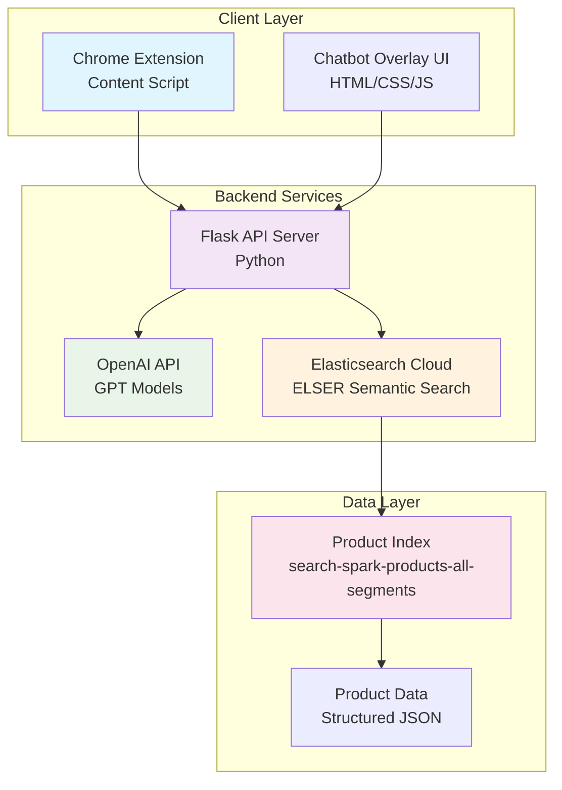
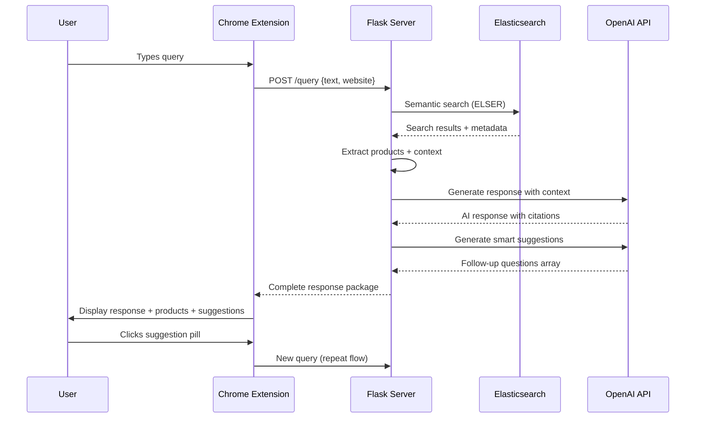
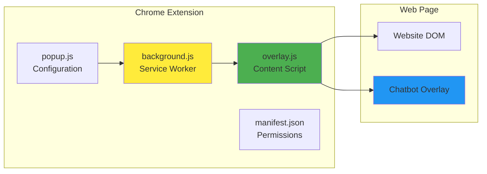
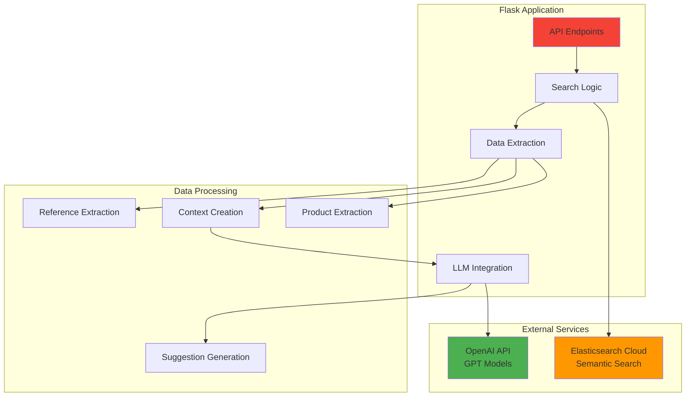
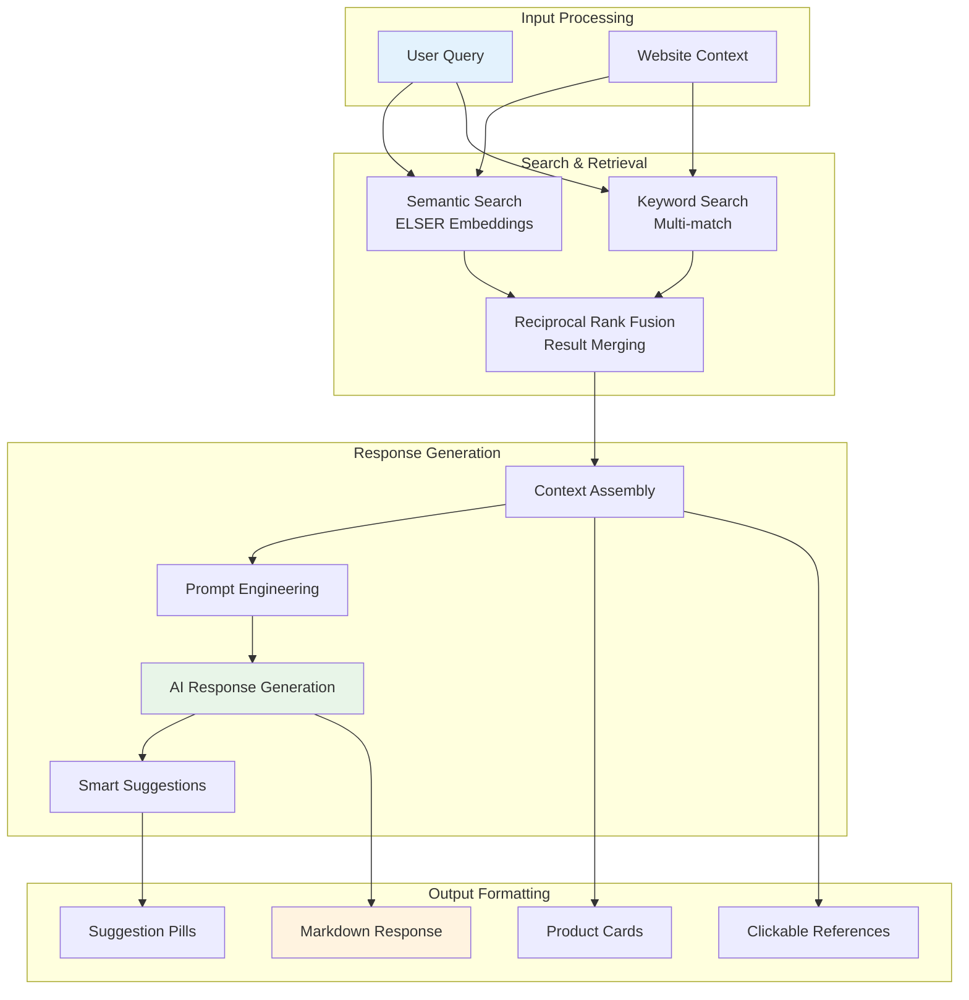
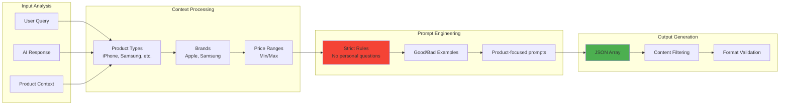
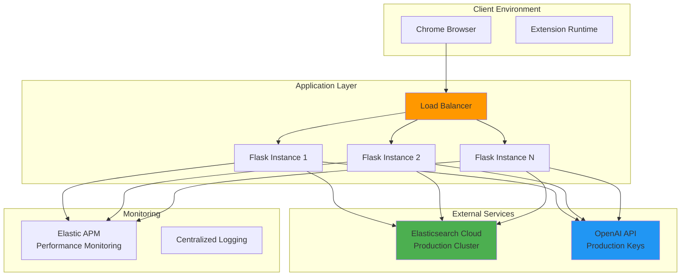
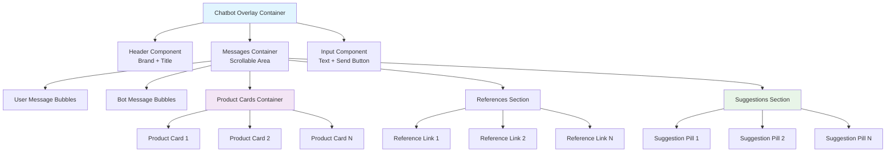
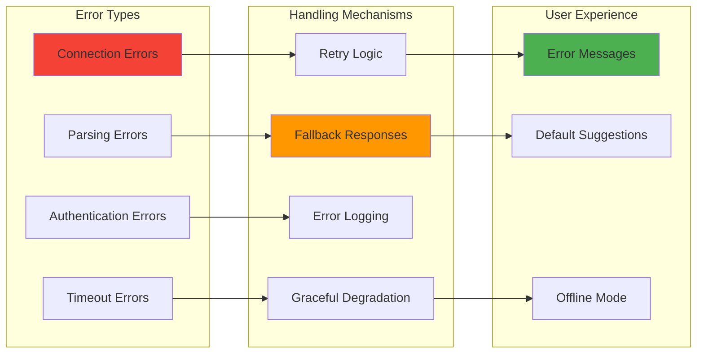

# RAG Chatbot Overlay - Technical Documentation

## Overview

The RAG (Retrieval-Augmented Generation) Chatbot Overlay is an intelligent e-commerce assistant that provides contextual product recommendations and support directly on customer websites. The system combines semantic search capabilities with large language models to deliver accurate, cited responses with smart follow-up suggestions.

## Key Features

- **🔍 Semantic Search**: Advanced ELSER-powered search through product catalogs
- **🤖 AI-Powered Responses**: OpenAI integration for natural language generation
- **📱 Chrome Extension**: Non-intrusive overlay that works on any configured website
- **🛍️ Product Cards**: Visual product recommendations with direct purchase links
- **📚 Clickable References**: Source citations that link back to original content
- **💡 Smart Suggestions**: AI-generated follow-up questions to guide customer journey
- **🎨 Modern UI**: Responsive design with smooth animations and gradients

---

## System Architecture

### High-Level Architecture Diagram



### Component Interaction Flow



---

## Technical Components

### 1. Chrome Extension Architecture



**Key Files:**
- `manifest.json` - Extension configuration and permissions
- `background.js` - Service worker for initialization
- `overlay.js` - Main content script with UI logic
- `overlay.css` - Modern styling with animations
- `popup.html/js` - Extension configuration interface

### 2. Backend API Architecture



### 3. Data Flow Architecture



---

## API Specification

### Main Query Endpoint

**POST** `/query`

```json
{
  "text": "Show me iPhone 15 cases",
  "website": "spark.co.nz"
}
```

**Response:**
```json
{
  "response": "I found several iPhone 15 cases for you [1][2]...",
  "sources": 5,
  "products": [
    {
      "name": "iPhone 15 Pro Clear Case",
      "price": 79.99,
      "url": "https://spark.co.nz/shop/...",
      "image": "/images/iphone-case.jpg",
      "sku": "IP15-CASE-001",
      "description": "Premium clear protection..."
    }
  ],
  "sourceDetails": [
    {
      "index": 1,
      "title": "iPhone 15 Pro Clear Case",
      "url": "https://spark.co.nz/shop/...",
      "description": "Premium clear protection...",
      "host": "spark.co.nz"
    }
  ],
  "suggestions": [
    "Check available colors",
    "Compare case materials", 
    "View screen protectors",
    "Find charging accessories"
  ]
}
```

### Status Endpoint

**GET** `/status`

Returns system health and configuration status.

---

## Core Technologies

### Backend Stack
- **Flask 3.0.0** - Web framework
- **Elasticsearch 8.12.0** - Semantic search engine
- **OpenAI 1.52.0** - Large language model integration
- **Python 3.8+** - Runtime environment

### Frontend Stack
- **Chrome Extension Manifest V3** - Browser extension framework
- **Vanilla JavaScript** - No external dependencies
- **CSS3** - Modern styling with animations
- **HTML5** - Semantic markup

### Search Technology
- **ELSER v2** - Elasticsearch Learned Sparse Encoder for semantic search
- **Reciprocal Rank Fusion (RRF)** - Multi-retriever result combining
- **Nested field indexing** - Structured product data storage

---

## Search Implementation Details

### Elasticsearch Query Strategy

The system uses a multi-retriever approach with RRF:

1. **Semantic Body Search**
   ```python
   {
     "nested": {
       "path": "semantic_body.inference.chunks",
       "query": {
         "sparse_vector": {
           "inference_id": ".elser-2-elasticsearch",
           "field": "semantic_body.inference.chunks.embeddings",
           "query": user_query
         }
       }
     }
   }
   ```

2. **Keyword Search Fallback**
   ```python
   {
     "multi_match": {
       "query": user_query,
       "fields": ["name^3", "title^2", "description", "color"],
       "type": "best_fields",
       "fuzziness": "AUTO"
     }
   }
   ```

3. **Result Fusion**
   - RRF combines multiple retriever scores
   - Ensures diverse, relevant results
   - Handles both semantic and exact matches

---

## Smart Suggestions Algorithm

### LLM-Powered Suggestion Generation



### Filtering Rules
- ❌ **Blocked patterns**: "Would you", "What are your", "What's your", "Do you", "Are you"
- ✅ **Encouraged patterns**: Imperative commands, product specifications, comparisons
- 🎯 **Focus areas**: Colors, pricing, alternatives, accessories, specifications

---

## Deployment Architecture

### Production Environment



---

## Security & Performance

### Security Measures
- **API Key Management**: Environment variable isolation
- **CORS Configuration**: Controlled cross-origin access
- **Input Sanitization**: XSS prevention in message rendering
- **Rate Limiting**: Configurable request throttling
- **Content Security Policy**: Extension security headers

### Performance Optimizations
- **Connection Pooling**: Persistent Elasticsearch connections
- **Response Caching**: Smart caching of frequently requested data
- **Lazy Loading**: Progressive UI component rendering
- **Debounced Queries**: Prevents excessive API calls
- **Compressed Responses**: Gzip compression for large payloads

---

## Installation & Configuration

### Environment Variables
```bash
# Required Configuration
ELASTIC_CLOUD_ID=your_elastic_cloud_id
ELASTIC_API_KEY=your_elastic_api_key
OPENAI_API_KEY=your_openai_api_key

# Optional Configuration
OPENAI_MODEL=gpt-3.5-turbo
OPENAI_BASE_URL=https://api.openai.com/v1
SEARCH_INDEX=search-spark-products-all-segments
```

### Chrome Extension Installation
1. Load unpacked extension in Chrome Developer Mode
2. Configure target websites in extension popup
3. Grant necessary permissions for content script injection

### Backend Deployment
```bash
# Install dependencies
pip install -r requirements.txt

# Set environment variables
export ELASTIC_CLOUD_ID="your_cloud_id"
export ELASTIC_API_KEY="your_api_key"
export OPENAI_API_KEY="your_openai_key"

# Start server
python server.py
```

---

## Index Schema Requirements

### Expected Elasticsearch Index Structure

```json
{
  "mappings": {
    "properties": {
      "name": {"type": "text"},
      "title": {"type": "text"},
      "description": {"type": "text"},
      "price": {"type": "float"},
      "sku": {"type": "keyword"},
      "url": {"type": "keyword"},
      "url_host": {"type": "keyword"},
      "image": {"type": "keyword"},
      "color": {"type": "keyword"},
      "meta_description": {"type": "text"},
      "semantic_body": {
        "properties": {
          "inference": {
            "properties": {
              "chunks": {
                "type": "nested",
                "properties": {
                  "text": {"type": "text"},
                  "embeddings": {
                    "type": "sparse_vector"
                  }
                }
              }
            }
          }
        }
      }
    }
  }
}
```

---

## User Interface Components

### Component Hierarchy



---

## API Integration Details

### OpenAI Integration Pattern

```python
def generate_smart_suggestions(context, user_question, ai_response, products):
    """
    Smart suggestion generation with strict filtering
    """
    suggestions_prompt = f"""
    STRICT RULES for generating suggestions:
    1. NEVER start with: "Would you", "What are your", "What's your"
    2. ONLY generate product-focused, actionable questions
    3. Focus on: specifications, availability, comparisons, pricing
    
    Context: {context}
    User Question: {user_question}
    AI Response: {ai_response}
    
    Generate 3-4 product-focused follow-up questions.
    """
    
    response = openai_client.chat.completions.create(
        model=OPENAI_MODEL,
        messages=[
            {"role": "system", "content": "Generate product-focused suggestions only."},
            {"role": "user", "content": suggestions_prompt}
        ],
        temperature=0.8,
        max_tokens=200
    )
    
    return json.loads(response.choices[0].message.content)
```

### Elasticsearch Integration Pattern

```python
def search_semantic_body(query, website=None):
    """
    ELSER semantic search implementation
    """
    bool_query = {
        "must": [
            {
                "nested": {
                    "path": "semantic_body.inference.chunks",
                    "query": {
                        "sparse_vector": {
                            "inference_id": ".elser-2-elasticsearch",
                            "field": "semantic_body.inference.chunks.embeddings",
                            "query": query
                        }
                    },
                    "inner_hits": {"size": 10, "name": "semantic_body"}
                }
            }
        ]
    }
    
    return es_client.search(index=SEARCH_INDEX, body={"query": {"bool": bool_query}})
```

---

## Error Handling & Monitoring

### Error Handling Strategy



### Monitoring Endpoints
- `/status` - System health check
- `/metrics` - Performance metrics (if APM enabled)
- Console logging with structured format

---

## Customization Guide

### Adding New Websites
1. Update `background.js` with additional domains
2. Configure website-specific search filters
3. Adjust image domain resolution in `getDomainForImages()`

### Modifying Suggestion Rules
Update the `generate_smart_suggestions()` function with new filtering rules:

```python
# Add new blocked patterns
blocked_patterns = [
    "Would you", "What are your", "What's your", 
    "Do you", "Are you", "How about you"  # Add more patterns
]

# Add new encouraged patterns
encouraged_patterns = [
    "Check", "Compare", "View", "Find", "Show", "Browse"
]
```

### Styling Customization
Key CSS variables for theming:
```css
:root {
  --primary-gradient: linear-gradient(135deg, #667eea 0%, #764ba2 100%);
  --border-radius: 20px;
  --shadow-main: 0 20px 40px rgba(0,0,0,0.15);
  --animation-speed: 0.3s;
}
```

---

## Performance Metrics

### Expected Performance
- **Query Response Time**: < 2 seconds
- **UI Rendering**: < 100ms after data received
- **Memory Usage**: < 50MB extension footprint
- **Search Accuracy**: > 85% relevant results

### Scalability Considerations
- **Concurrent Users**: Scales with Flask worker processes
- **Query Volume**: Limited by OpenAI API rate limits
- **Search Load**: Elasticsearch Cloud auto-scaling
- **Extension Distribution**: Chrome Web Store deployment

---

## Future Enhancements

### Planned Features
1. **Voice Query Support** - Speech-to-text integration
2. **Multi-language Support** - Internationalization
3. **Advanced Analytics** - User interaction tracking
4. **A/B Testing Framework** - Suggestion algorithm optimization
5. **Personalization Engine** - User preference learning

### Technical Debt
- Migrate to TypeScript for better type safety
- Implement comprehensive test suite
- Add Redis caching layer
- Optimize bundle size for faster loading

---

## Troubleshooting

### Common Issues

**Extension Not Loading**
- Check Chrome Developer Mode is enabled
- Verify manifest.json permissions
- Check console for JavaScript errors

**No Search Results**
- Verify Elasticsearch connection in `/status`
- Check index name configuration
- Validate ELSER model deployment

**Suggestions Not Generating**
- Check OpenAI API key validity
- Monitor rate limiting in logs
- Verify JSON parsing in response

**Product Cards Not Displaying**
- Check image domain configuration
- Verify product URL format
- Test network connectivity

---

## Support & Maintenance

### Monitoring Checklist
- [ ] Elasticsearch cluster health
- [ ] OpenAI API quota usage
- [ ] Extension error rates
- [ ] Response time metrics
- [ ] User engagement analytics

### Regular Maintenance
- **Weekly**: Review error logs and performance metrics
- **Monthly**: Update dependencies and security patches
- **Quarterly**: Optimize search relevance and suggestion quality

---

*This documentation is designed for software developers and architects implementing or maintaining the RAG Chatbot Overlay system.*
