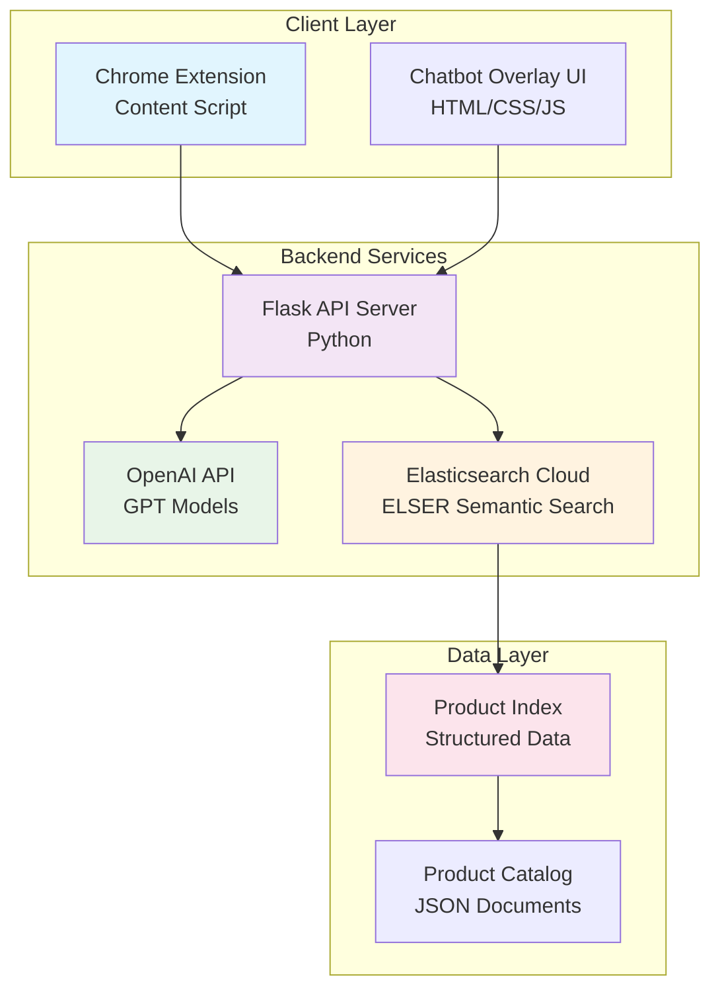
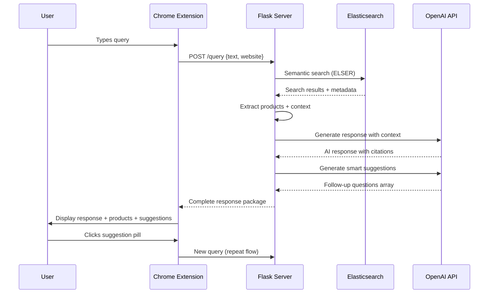
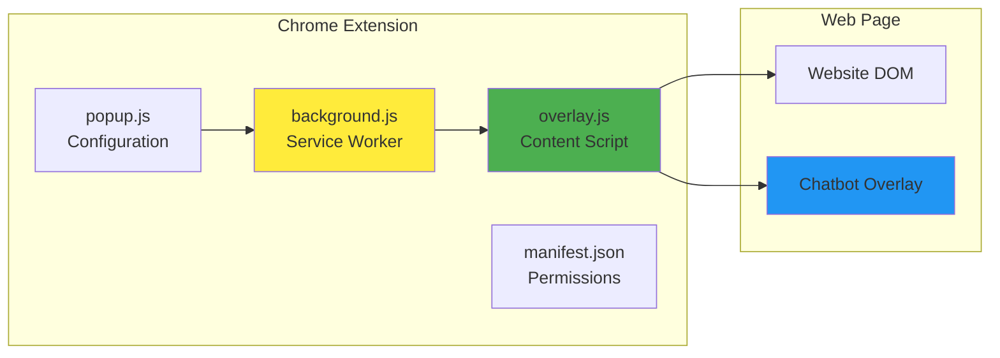
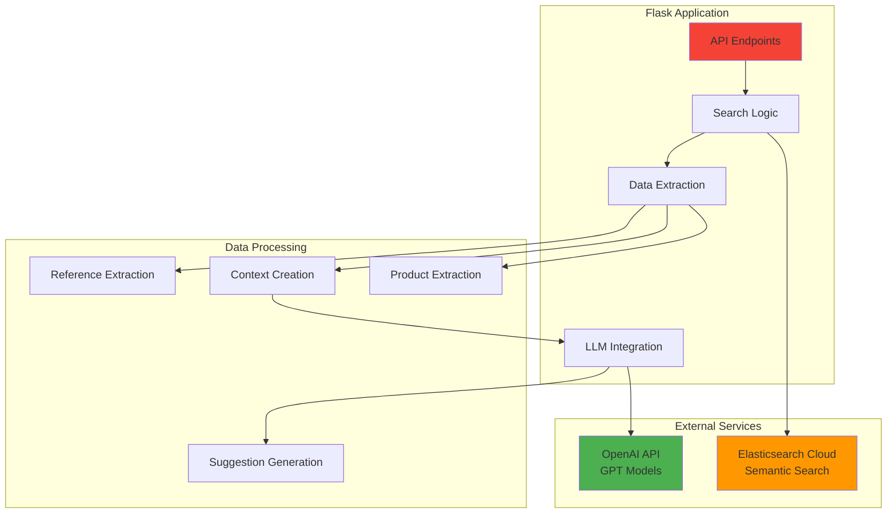
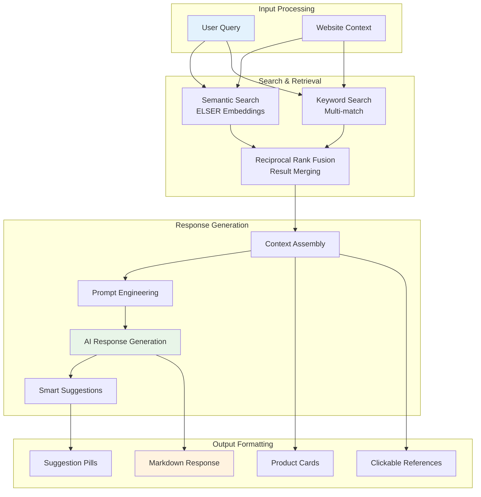
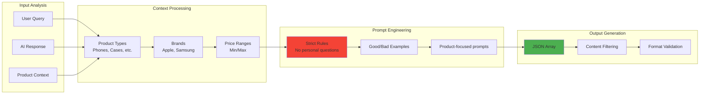
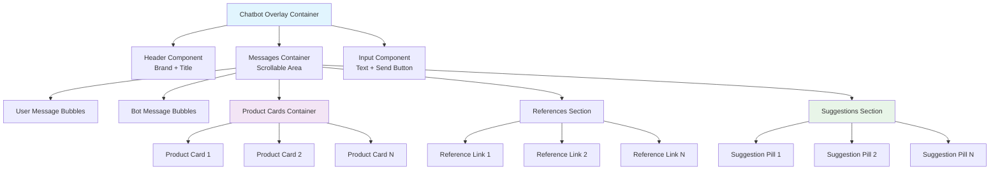
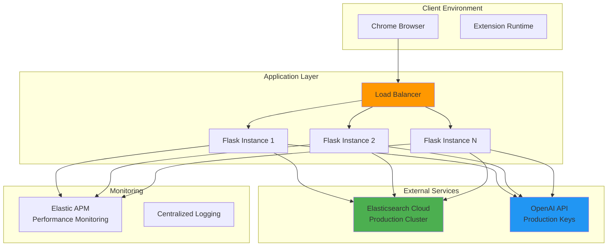
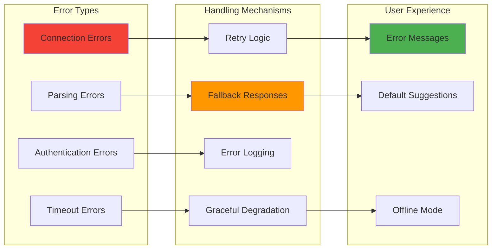

# RAG Chatbot Overlay - Technical Documentation

## Executive Summary

This document describes a retrieval-augmented generation (RAG) chatbot system designed as a Chrome extension overlay for e-commerce websites. The system combines semantic search with large language models to provide intelligent product recommendations and customer support directly within the browser.

The solution addresses the common challenge of helping customers find relevant products quickly by understanding natural language queries and providing contextual, cited responses along with visual product cards and intelligent follow-up suggestions.

---

## System Overview

The chatbot operates as a browser extension that injects an overlay interface into configured websites. When a user asks a question, the system searches an Elasticsearch index using semantic search, retrieves relevant products, generates a conversational response using OpenAI's GPT models, and suggests relevant follow-up queries to guide the customer journey.

### Core Capabilities

The system provides several key features:

- Semantic search across product catalogs using ELSER embeddings
- Natural language response generation with source citations
- Visual product cards with images, pricing, and purchase links
- Clickable reference links to source documents
- AI-generated follow-up questions tailored to the conversation context
- Responsive UI with smooth animations and modern design patterns

### Technology Stack

The backend runs on Flask and integrates with Elasticsearch Cloud for search and OpenAI for language generation. The frontend is a vanilla JavaScript Chrome extension with no external dependencies, making it lightweight and fast.

---

## System Architecture

### High-Level Architecture

The system consists of three main layers: the client layer (Chrome extension), the application layer (Flask API), and the data layer (Elasticsearch indices).



When a user submits a query, the extension sends it to the Flask server, which performs a semantic search in Elasticsearch. The search results are then packaged with context and sent to OpenAI to generate a natural language response. The server also calls OpenAI again to generate smart follow-up questions based on the conversation context. All of this is then returned to the extension for display.

### Request Flow

A typical user interaction follows this sequence:



This architecture keeps the client lightweight while offloading heavy processing to the server. The extension only handles UI rendering and user interaction.

---

## Chrome Extension Architecture

### Component Structure

The extension consists of four main files working together:



The background service worker initializes the extension and manages configuration. The content script injects the overlay into matching websites and handles all user interactions. The popup provides a configuration interface where users can add or remove websites where the chatbot should appear.

### Key Files

**manifest.json** defines the extension metadata, permissions, and content script injection rules. It uses Manifest V3, which is the current standard for Chrome extensions.

**background.js** runs as a service worker and sets default configuration when the extension is first installed. It maintains the list of websites where the overlay should appear.

**overlay.js** is the main content script that creates the chatbot UI, handles user input, makes API calls to the Flask server, and renders responses. It includes markdown parsing, product card rendering, and suggestion pill generation.

**overlay.css** provides all styling with modern CSS including gradients, animations, and responsive design patterns. The design uses a purple gradient theme with smooth transitions.

**popup.html/js** creates the extension popup interface where users can configure which websites should display the chatbot overlay.

---

## Backend Architecture

### Flask Application Structure

The Flask server handles three main responsibilities: search orchestration, response generation, and suggestion creation.



The search logic queries Elasticsearch using ELSER semantic embeddings to find relevant products. Results are then processed to extract structured product data and create a context string that includes all relevant information. This context, along with the user's query, is sent to OpenAI to generate a conversational response. A second OpenAI call generates follow-up suggestions based on the conversation context.

### API Endpoints

The server exposes two main endpoints:

**POST /query** accepts a user question and website context, performs the search and generation pipeline, and returns a complete response package including the AI-generated text, product cards, source references, and smart suggestions.

**GET /status** returns health check information about the Elasticsearch and OpenAI connections, useful for monitoring and debugging.

---

## Data Flow

### Processing Pipeline

The data flows through several transformation stages from query to response:



First, the query goes through semantic search using ELSER embeddings to find conceptually similar content, even if exact keywords don't match. A keyword search runs in parallel as a fallback. Reciprocal Rank Fusion combines results from both approaches to ensure we get both semantic matches and exact keyword matches.

The search results are transformed into a structured context that includes product names, descriptions, prices, colors, and other attributes. This context is formatted into a prompt that instructs the AI on how to respond (conversational, helpful, with citations). The AI generates a response using this context.

A second AI call analyzes the conversation and product context to generate relevant follow-up questions. These are filtered to ensure they focus on products rather than personal preferences.

Finally, all components (AI response, product cards, references, suggestions) are packaged and sent back to the extension for rendering.

---

## Search Implementation

### Elasticsearch Query Strategy

The search uses a nested query structure to access ELSER embeddings stored in a specific field structure:

```python
{
  "nested": {
    "path": "semantic_body.inference.chunks",
    "query": {
      "sparse_vector": {
        "inference_id": ".elser-2-elasticsearch",
        "field": "semantic_body.inference.chunks.embeddings",
        "query": user_query
      }
    },
    "inner_hits": {
      "size": 10,
      "name": "semantic_body",
      "_source": ["text"]
    }
  }
}
```

This structure allows the search to find semantically similar content even when the exact words differ. For example, searching for "phone protection" would find results about "cases" and "screen protectors" because ELSER understands the semantic relationship.

The inner_hits parameter ensures we get the actual text chunks that matched, which helps with context creation and citation accuracy.

### Multi-Match Fallback

A keyword search runs in parallel using a multi_match query across several fields:

```python
{
  "multi_match": {
    "query": user_query,
    "fields": ["name^3", "title^2", "description", "color"],
    "type": "best_fields",
    "fuzziness": "AUTO"
  }
}
```

Field boosting (the ^3 and ^2 notation) makes matches in the name field more important than matches in the description. The AUTO fuzziness handles typos gracefully.

### Result Fusion

Reciprocal Rank Fusion combines results from multiple retrievers using a formula that gives higher weight to documents that rank highly across multiple search strategies. This ensures we don't miss relevant results that might only match one approach.

---

## Smart Suggestions System

### Generation Strategy

The suggestions feature uses a separate OpenAI call with carefully crafted prompts to generate relevant follow-up questions:



The system first analyzes the available products to understand what types of items are being discussed (phones, accessories, specific brands, price ranges). This context is included in the prompt to help generate relevant suggestions.

The prompt includes strict rules to prevent generating conversational questions that sound like "Would you like to see more options?" or "What's your budget?". Instead, it focuses on actionable, product-specific queries like "Check available colors" or "Compare similar models".

### Filtering Rules

The prompt explicitly blocks certain patterns:

- Questions starting with "Would you", "What are your", "What's your", "Do you", "Are you"
- Personal preference questions
- Generic conversational prompts
- Non-actionable questions

It encourages patterns that focus on:

- Product specifications and features
- Availability and pricing information
- Comparisons between options
- Related products and accessories
- Customer reviews and ratings

### Fallback Behavior

If the OpenAI call fails or returns invalid JSON, the system has default suggestions to ensure the user experience isn't broken:

- "What colors are available?"
- "Show me similar products"
- "Any current deals?"
- "What accessories do I need?"

These defaults are generic enough to work in most contexts while still being useful.

---

## API Specification

### Query Endpoint

**Endpoint:** POST /query

**Request Body:**
```json
{
  "text": "Show me iPhone 15 cases",
  "website": "example.com"
}
```

The text field contains the user's natural language query. The website field provides context about which site the user is on, allowing for site-specific filtering if needed.

**Response Body:**
```json
{
  "response": "I found several iPhone 15 cases for you [1][2]...",
  "sources": 5,
  "products": [
    {
      "name": "iPhone 15 Pro Clear Case",
      "price": 79.99,
      "url": "https://example.com/shop/...",
      "image": "/images/iphone-case.jpg",
      "sku": "IP15-CASE-001",
      "description": "Premium clear protection..."
    }
  ],
  "sourceDetails": [
    {
      "index": 1,
      "title": "iPhone 15 Pro Clear Case",
      "url": "https://example.com/shop/...",
      "description": "Premium clear protection...",
      "host": "example.com"
    }
  ],
  "suggestions": [
    "Check available colors",
    "Compare case materials", 
    "View screen protectors",
    "Find charging accessories"
  ]
}
```

The response field contains the markdown-formatted AI response with citation numbers in brackets. The sources field indicates how many search results were found. The products array contains structured product data for rendering cards. The sourceDetails array provides information for making references clickable. The suggestions array contains follow-up questions.

### Status Endpoint

**Endpoint:** GET /status

**Response Body:**
```json
{
  "status": "OK",
  "elasticsearch": {
    "status": "connected",
    "cluster_name": "production-cluster",
    "index": "product-catalog"
  },
  "openai": {
    "status": "connected",
    "model": "gpt-3.5-turbo"
  }
}
```

This endpoint is useful for health checks and monitoring. It verifies connectivity to both Elasticsearch and OpenAI.

---

## User Interface

### Component Hierarchy

The overlay UI is built from several nested components:



The overlay is a fixed-position container in the bottom-right corner of the page. It contains three main sections: a header with branding, a scrollable messages area, and an input section at the bottom.

Messages can be user bubbles (right-aligned, purple gradient) or bot bubbles (left-aligned, white with border). Bot messages can also include special sections like product cards, references, and suggestions.

Product cards display in a horizontal scroll container, allowing users to swipe through multiple options. Each card shows an image, name, category, price, and a "View Details" button.

References appear in a light gray box with numbered badges. When a reference has a valid URL, it becomes clickable and opens in a new tab.

Suggestions display as pill-shaped buttons in a wrapping grid. Clicking a suggestion automatically submits it as a new query.

### Design Patterns

The UI uses several modern design patterns:

**Gradients:** Purple to violet gradients create visual interest and brand consistency across buttons, headers, and user messages.

**Smooth animations:** Components fade in and slide up when they appear, creating a polished feel. Product cards and suggestion pills have staggered delays so they appear sequentially.

**Hover states:** Interactive elements (buttons, cards, suggestions, references) all have hover effects that provide visual feedback. This includes transforms (lifting elements), shadow changes, and color transitions.

**Scrollable containers:** The main messages area and product card container both scroll independently, with custom styled scrollbars that match the purple theme.

**Responsive sizing:** While the overlay has a fixed width for desktop, the internal layouts use flexbox to adapt to content. Suggestions wrap to multiple rows if needed.

---

## Data Schema

### Elasticsearch Index Structure

The system expects products to be indexed with this general structure:

```json
{
  "name": "Product Name",
  "title": "Page Title",
  "description": "Product description text",
  "price": 99.99,
  "sku": "PROD-001",
  "url": "https://example.com/product",
  "url_host": "example.com",
  "image": "/images/product.jpg",
  "color": "Blue",
  "meta_description": "SEO description",
  "semantic_body": {
    "inference": {
      "chunks": [
        {
          "text": "Chunk of text content",
          "embeddings": {
            /* ELSER sparse vector */
          }
        }
      ]
    }
  }
}
```

The semantic_body field structure is critical for ELSER search to work. The text chunks should be created during indexing by breaking up longer descriptions into meaningful segments. The embeddings are generated automatically by the ELSER model during inference.

---

## Configuration

### Environment Variables

The Flask server requires these environment variables:

```bash
ELASTIC_CLOUD_ID=your_elastic_cloud_id
ELASTIC_API_KEY=your_elastic_api_key
OPENAI_API_KEY=your_openai_api_key
```

Optional variables allow customization:

```bash
OPENAI_MODEL=gpt-3.5-turbo
OPENAI_BASE_URL=https://api.openai.com/v1
SEARCH_INDEX=product-catalog
```

The OPENAI_MODEL can be changed to use gpt-4 or other models. The SEARCH_INDEX should match your Elasticsearch index name.

### Extension Configuration

The extension stores its configuration in Chrome's sync storage, which means settings sync across devices for the same user. The background.js file initializes this with a default website list, which can be modified through the popup interface.

Users can add or remove websites by clicking the extension icon and using the configuration popup. The extension checks the current page's hostname against this list to decide whether to inject the overlay.

---

## Security Considerations

### API Security

The Flask server uses CORS to control which domains can make requests. In production, this should be configured to only allow requests from your actual domains rather than allowing all origins.

API keys for Elasticsearch and OpenAI are stored as environment variables and never exposed to the client. The extension doesn't need to know these credentials since all API calls go through the Flask server.

### Input Sanitization

User input is sanitized before rendering to prevent XSS attacks. The overlay.js includes a sanitizeText function that removes HTML tags and encodes special characters. Markdown rendering is done through a controlled parser that only allows specific safe elements.

### Content Security Policy

The extension manifest includes appropriate permissions and host_permissions to minimize security risks. The content script only has access to the DOM of pages that match the configured websites.

---

## Performance

### Optimization Strategies

Several techniques keep the system performant:

**Connection pooling:** The Elasticsearch client maintains persistent connections to reduce latency on repeated queries.

**Lazy loading:** The extension only creates the overlay DOM when needed and progressively renders components as data arrives.

**Debouncing:** While not currently implemented, adding input debouncing would prevent excessive API calls as users type.

**Compressed responses:** The Flask server should be configured with gzip compression for JSON responses, significantly reducing bandwidth usage.

**Caching:** Frequently requested products could be cached server-side with a short TTL to reduce Elasticsearch load.

### Expected Performance

In typical usage, the system should achieve:

- Query response time under 2 seconds from user input to full render
- UI rendering under 100ms once data is received
- Extension memory footprint under 50MB
- Search relevance above 85% for well-formed queries

These numbers depend heavily on Elasticsearch cluster performance and OpenAI API response times.

---

## Deployment

### Production Architecture

A production deployment would typically look like this:



Multiple Flask instances sit behind a load balancer for high availability. All instances connect to the same Elasticsearch cluster and use the same OpenAI API key. Elastic APM provides performance monitoring and distributed tracing.

### Installation Steps

To deploy the backend:

1. Install Python dependencies from requirements.txt
2. Set environment variables for Elasticsearch and OpenAI credentials
3. Verify connectivity with the /status endpoint
4. Configure the load balancer or reverse proxy
5. Start Flask with a production WSGI server like Gunicorn

To install the extension:

1. Package the extension files into a directory
2. Load as an unpacked extension in Chrome Developer Mode for testing
3. For production, publish to the Chrome Web Store after review
4. Users install from the store and configure their websites

---

## Error Handling

### Strategy

The system handles errors at multiple levels:



Connection errors trigger retry logic with exponential backoff. If retries fail, a user-friendly error message is displayed rather than crashing.

Authentication errors are logged but not retried, since they indicate a configuration problem that needs manual intervention.

Parsing errors (like invalid JSON from OpenAI) trigger fallback to default suggestions so the user experience isn't completely broken.

Timeouts trigger graceful degradation, where the system might return partial results or cached data if available.

### User-Facing Messages

Error messages are written in plain language rather than exposing technical details:

- "I encountered an error while processing your request. Please try again."
- "I couldn't find any relevant products for your query. Please try different keywords."
- "The service is temporarily unavailable. Please try again in a moment."

These messages maintain the conversational tone while clearly indicating something went wrong.

---

## Customization

### Adding New Websites

To support additional websites, update the background.js file to include them in the default configuration:

```javascript
chrome.storage.sync.set({
  websites: ['example.com', 'shop.example.com', 'store.example.com']
});
```

Users can also add websites through the popup interface without code changes.

### Modifying Suggestion Behavior

The smart suggestions are controlled by the prompt in the generate_smart_suggestions function. To change what types of suggestions are generated, modify the rules and examples in that prompt.

For example, to encourage more comparison questions:

```python
Good examples:
- "Compare X vs Y"
- "What's the difference between X and Y?"
- "Show me alternatives to X"
```

To discourage certain topics:

```python
NEVER ask about:
- Shipping or delivery times
- Return policies
- Payment methods
```

### Styling Changes

The visual design is controlled entirely by overlay.css. Key variables at the top of the file can be adjusted to change the overall theme:

```css
/* Primary gradient used for buttons and header */
background: linear-gradient(135deg, #667eea 0%, #764ba2 100%);

/* Main container border radius */
border-radius: 20px;

/* Shadow depth */
box-shadow: 0 20px 40px rgba(0,0,0,0.15);
```

Changing these values will update the design system-wide while maintaining consistency.

---

## Monitoring and Maintenance

### Health Checks

The /status endpoint should be monitored regularly to ensure both Elasticsearch and OpenAI connections are healthy. A monitoring system can poll this endpoint and alert if either service shows as disconnected.

Key metrics to track:

- Average query response time
- Error rate by endpoint
- Search result relevance (requires manual evaluation)
- Suggestion click-through rate
- Product card conversion rate

### Regular Maintenance

The system requires minimal ongoing maintenance:

**Weekly:** Review error logs to identify any patterns or recurring issues. Check OpenAI API usage to ensure staying within quota limits.

**Monthly:** Update Python dependencies to patch security vulnerabilities. Review search relevance by testing common queries and evaluating result quality.

**Quarterly:** Retrain or update the ELSER model if Elasticsearch releases new versions. Evaluate suggestion quality and adjust prompts if needed. Review and optimize slow queries in Elasticsearch.

### Logging

The Flask application logs all queries, search results, and errors with structured logging. In production, these logs should be shipped to a centralized logging system for analysis.

Key events to log:

- Every query with response time
- Search failures or empty results
- OpenAI API errors or rate limits
- Unusual patterns (same query repeated many times)

---

## Troubleshooting

### Common Issues

**Extension doesn't appear on the page**

Check that the website hostname matches one in the configured list. Open the Chrome DevTools console to look for JavaScript errors. Verify the extension is enabled in chrome://extensions.

**Search returns no results**

Verify the Elasticsearch connection using the /status endpoint. Check that the SEARCH_INDEX environment variable matches your actual index name. Confirm that ELSER embeddings exist in the semantic_body field.

**Suggestions are generic or repetitive**

The OpenAI model may need more context to generate good suggestions. Try adjusting the temperature parameter (higher = more creative, lower = more focused). Review the prompt for the suggestions generation to ensure it includes enough product context.

**Product cards not displaying correctly**

Check the image URLs in the Elasticsearch documents. Verify that the getDomainForImages function in overlay.js returns the correct domain for your environment. Test image URLs directly in a browser to ensure they're accessible.

**Slow response times**

Profile the request to identify bottlenecks. Elasticsearch queries typically take 200-500ms, while OpenAI calls can take 1-2 seconds. Consider caching frequently requested products or implementing request queuing to prevent overwhelming the APIs.

---

## Future Enhancements

Several features could enhance the system:

**Voice input:** Adding speech-to-text would allow hands-free queries, particularly useful on mobile devices.

**Multi-language support:** Internationalizing the UI and supporting queries in multiple languages would expand the potential user base.

**Personalization:** Learning user preferences over time and incorporating them into search ranking and suggestions would improve relevance.

**A/B testing framework:** Building infrastructure to test different suggestion strategies or UI designs would enable data-driven optimization.

**Advanced analytics:** Tracking user interactions, conversion rates, and common query patterns would provide insights for improving the product.

**Mobile app:** While currently a Chrome extension, the core functionality could be adapted for native mobile applications.

---

## Technical Dependencies

### Backend Requirements

- Python 3.8 or higher
- Flask 3.0.0
- Flask-CORS 4.0.0  
- Elasticsearch 8.12.0 client library
- OpenAI 1.52.0 client library
- python-dotenv 1.0.0

### Frontend Requirements

- Chrome browser (version 88 or higher for Manifest V3 support)
- No external JavaScript libraries (vanilla JS only)
- Modern CSS support (flexbox, gradients, animations)

### External Services

- Elasticsearch Cloud with ELSER v2 model deployed
- OpenAI API access with sufficient quota
- Domain hosting for the Flask application

---

## Conclusion

This RAG chatbot system provides an intelligent, conversational interface for product discovery on e-commerce websites. By combining semantic search with large language models, it can understand natural language queries and provide helpful, cited responses along with visual product recommendations.

The modular architecture makes it easy to deploy, customize, and maintain. The Chrome extension approach means no changes are required to the underlying website, making integration straightforward.

The smart suggestions feature helps guide users through their shopping journey by anticipating relevant follow-up questions, improving engagement and conversion rates.

With proper configuration and monitoring, this system can handle significant query volume while maintaining fast response times and high relevance.
